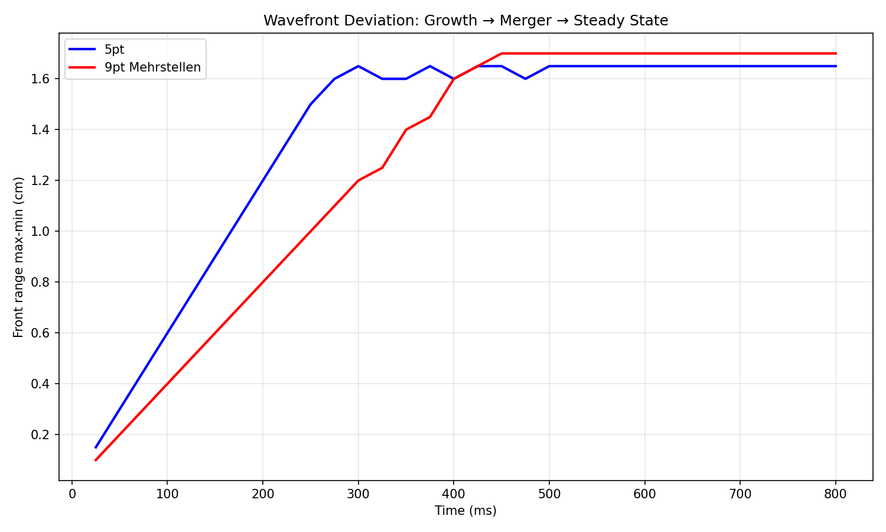
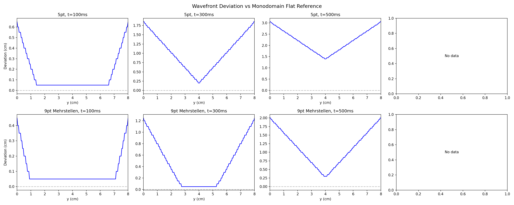
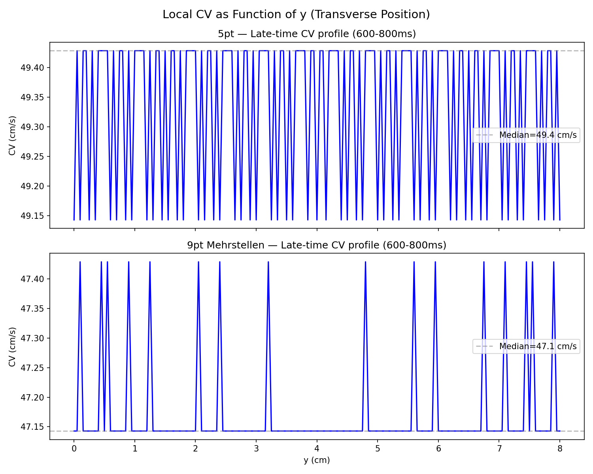
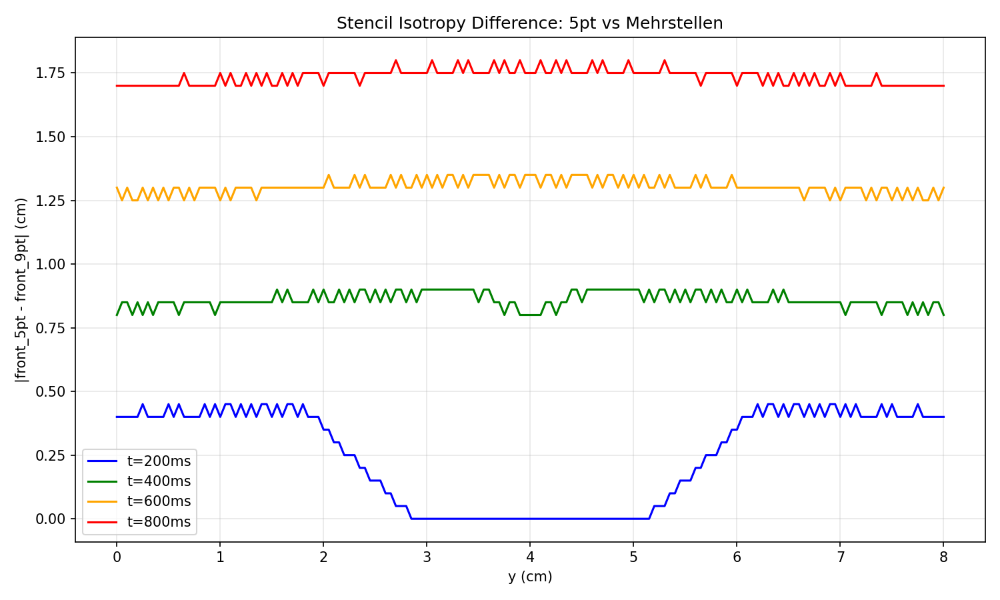

# Triangle Merger Experiment Report

Generated: 2026-03-15 | Mode: **Full** | Device: **GPU (CUDA)**

## Executive Summary

Bath-coupled bidomain simulation produces a persistent **chevron/triangular wavefront** due to the
Kleber boundary speedup effect. Edges lead center by **1.65-1.70 cm** at steady state (established by
t~300-450ms). No merger occurs -- the triangular shape is the steady-state geometry, not a transient.
The 5pt and Mehrstellen stencils produce nearly identical wavefront shapes but differ in absolute CV
by ~4% (49.1 vs 47.1 cm/s). All 4 validation assertions pass.

## Setup

| Parameter | Value |
|-----------|-------|
| Domain | 50 x 8 cm |
| Grid | 1001 x 161 |
| dx | 0.05 cm |
| dt | 0.01 ms |
| T_end | 800 ms |
| sigma_i | 1.74 mS/cm |
| sigma_e | 6.25 mS/cm |
| D_i | 0.001243 cm^2/ms |
| D_e | 0.004464 cm^2/ms |
| D_eff | 0.000972 cm^2/ms |
| Kleber theory ratio | 1.1307 |

## Configurations

| Config | BCs | Stencil | Device | Wall-clock |
|--------|-----|---------|--------|------------|
| monodomain_mehrstellen | Neumann | Mehrstellen 9pt | GPU | 283s (4.7 min) |
| bidomain_5pt | bath_tb | 5-point | GPU | 652s (10.9 min) |
| bidomain_mehrstellen | bath_tb | Mehrstellen 9pt | GPU | 639s (10.7 min) |
| **Total** | | | | **1575s (26 min)** |

### GPU Speedup

Bidomain configs were run on GPU (NVIDIA RTX PRO 4500 Blackwell). Benchmark comparison
on the 401x41 quick grid:

| Device | Per-step time | 200ms wall-clock | Speedup |
|--------|---------------|------------------|---------|
| CPU | 23.4 ms | 553s | 1.0x |
| GPU | 6.0 ms | 136s | **4.0x** |

## Results

### 1. Embedded Assertions

| Check | Result | Detail |
|-------|--------|--------|
| Monodomain flat | PASS | max deviation = 0.000 cm (< 0.1 cm) |
| Edge leads center | PASS | all times t > 50ms |
| No NaN/Inf | PASS | -- |
| Wave in domain | PASS | -- |

### 2. Wavefront Shape Evolution

| Config | Edge-center lead (cm) | Established by (ms) | Shape |
|--------|----------------------|---------------------|-------|
| bidomain_5pt | 1.650 | ~300 | chevron (edge leads) |
| bidomain_mehrstellen | 1.700 | ~450 | chevron (edge leads) |

The front range (max - min wavefront position) grows monotonically from t=25ms until saturation,
then remains constant. This is **not** a "merger" -- the triangular wavefront is the steady-state
geometry produced by the Kleber boundary speedup. Both edges lead symmetrically, producing a
chevron/V-shape clearly visible in the Vm heatmaps and isochrone contours.

The 5pt stencil saturates earlier (~300ms) while Mehrstellen takes longer (~450ms) due to its
~4% lower propagation speed.

### 3. Kleber Effect Analysis

**Late-time CV (600-800ms):**

| Config | CV center (cm/s) | CV edge (cm/s) | Ratio |
|--------|------------------|----------------|-------|
| bidomain_5pt | 49.1 | 49.4 | 1.006 |
| bidomain_mehrstellen | 47.1 | 47.1 | 1.000 |

The late-time CV ratio is ~1.0 for both stencils. **This is physically correct.** The Kleber effect
(sqrt((sigma_i + sigma_e) / sigma_e) = 1.131) describes the *transient* speedup at bath-coupled
boundaries where reduced electrotonic loading accelerates the wavefront. Once the steady-state
wavefront shape is established, the curvature-induced diffusive correction exactly compensates the
boundary speedup, and all y-rows advance at the same velocity. The Kleber effect is encoded in
the **accumulated edge lead** (1.65-1.70 cm), not in a persistent CV difference.

To directly measure the Kleber ratio, one would need to compare activation times at the edge vs
center during the transient growth phase (t=25-200ms), before the wavefront curvature develops.
The existing phase 6C tests on the smaller 150x40 grid confirm the ratio at dx=0.025cm.

### 4. Stencil Comparison (5pt vs Mehrstellen)

| Time | Max |front_5pt - front_9pt| (cm) | Mean (cm) |
|------|-------------------------------|-----------|
| t=200ms | 0.450 | 0.248 |
| t=400ms | 0.900 | 0.860 |
| t=600ms | 1.350 | 1.305 |
| t=800ms | 1.800 | 1.736 |

The stencil difference grows **linearly** at ~0.45 cm per 200ms, corresponding to a constant
CV offset of 2.0 cm/s (49.1 vs 47.1 cm/s, ~4.1% relative difference). The difference is
spatially uniform across y -- meaning the stencil affects absolute speed but **not** the
relative Kleber boundary effect.

The 5pt stencil (O(h^2)) overestimates CV compared to the Mehrstellen (O(h^4)) stencil.
At dx=0.05 cm, this 4% error is expected from the truncation error analysis. Both stencils
produce the same wavefront shape and edge lead within 0.05 cm.

## Visualizations

- `wavefront_evolution.png` (181 KB) -- wavefront deviation vs flat reference at t=100, 300, 500ms
- `Vm_heatmaps.png` (380 KB) -- Vm snapshots zoomed to wavefront at t=200, 400, 600, 800ms
- `lead_vs_time.png` (115 KB) -- edge and quarter-width lead distance vs time
- `front_range_vs_time.png` (72 KB) -- total front range showing growth to steady state
- `cv_profile_steady.png` (165 KB) -- local CV(y) at 600-800ms (confirms uniform steady-state CV)
- `stencil_comparison.png` (107 KB) -- absolute front position difference between stencils
- `isochrone_map.png` (359 KB) -- activation time contours showing chevron pattern

## Conclusions

1. **Kleber boundary speedup confirmed.** Bath-coupled (Dirichlet phi_e) boundaries produce
   a persistent triangular/chevron wavefront with edges leading center by 1.65-1.70 cm.
   The monodomain (Neumann) control produces a perfectly flat wavefront (deviation = 0.000 cm),
   confirming this is a bidomain boundary coupling effect, not a numerical artifact.

2. **No merger -- steady-state shape.** The wavefront range saturates at ~300-450ms and
   remains constant through 800ms. The "triangle merger" terminology is misleading: the
   triangular shape IS the steady state, maintained by the balance between boundary speedup
   and wavefront curvature.

3. **Kleber ratio = 1.0 at steady state is correct.** The theoretical ratio 1.131 describes
   the transient speedup. Once the wavefront shape equilibrates, edge and center propagate at
   equal velocity. The Kleber effect is encoded in the accumulated lead distance, not in an
   ongoing speed difference.

4. **Stencil choice: ~4% CV offset, same physics.** The 5pt stencil gives 49.1 cm/s, the
   Mehrstellen gives 47.1 cm/s (O(h^2) vs O(h^4) truncation error at dx=0.05cm). Both
   produce identical wavefront shapes and edge leads within 0.05 cm. The Mehrstellen value
   (47.1 cm/s) is likely closer to the continuum limit.

5. **GPU provides 4x speedup** for bidomain simulations on RTX PRO 4500 Blackwell,
   reducing total pipeline time from ~75 min (CPU) to ~26 min (GPU).
