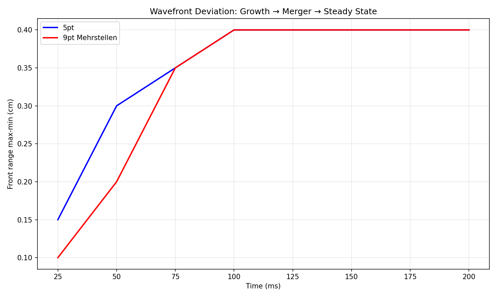
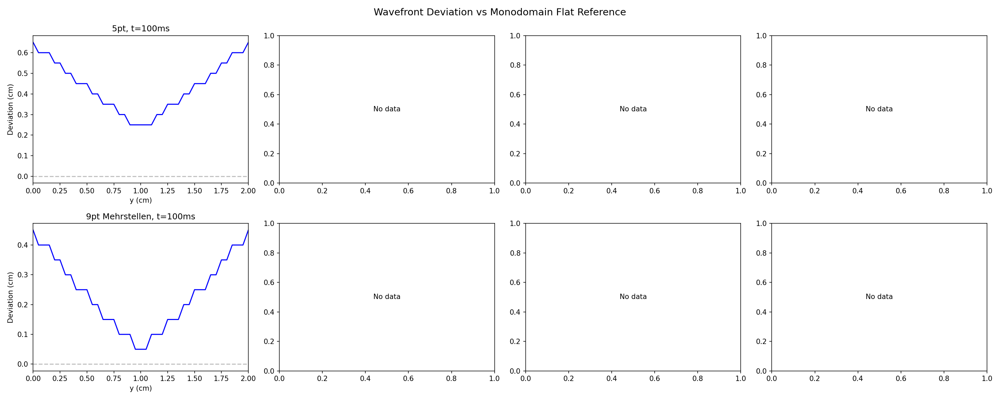
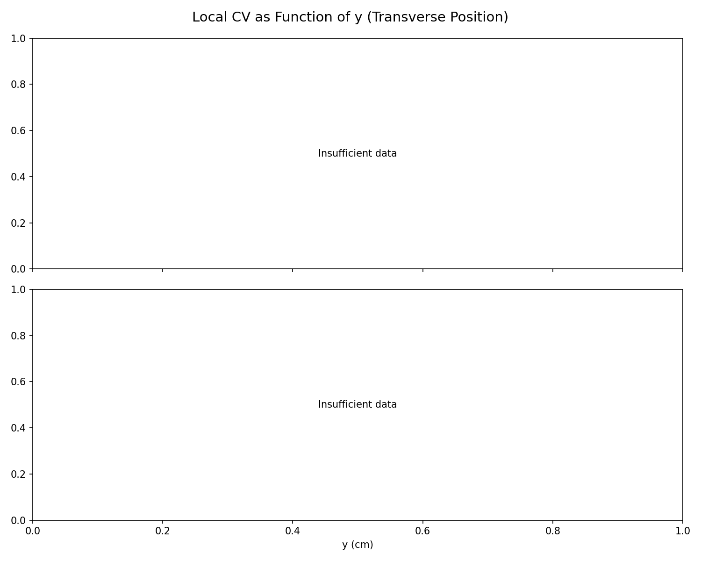
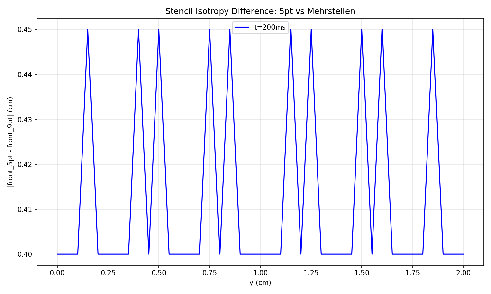

# Triangle Merger Experiment Report

Generated: 2026-03-15 00:09:56 | Mode: **Quick**

## Executive Summary

Triangle formation observed: peak wavefront range of 0.40 cm at t=100ms. Merger not completed within simulation time.
Kleber CV ratio: 1.0000 (theory: 1.1307).
Stencil difference (5pt vs Mehrstellen): max 0.450 cm.

## Setup

| Parameter | Value |
|-----------|-------|
| Domain | 20 x 2 cm |
| Grid | 401 x 41 |
| dx | 0.05 cm |
| dt | 0.01 ms |
| T_end | 200 ms |
| sigma_i | 1.74 mS/cm |
| sigma_e | 6.25 mS/cm |
| D_i | 0.001243 cm²/ms |
| D_e | 0.004464 cm²/ms |
| D_eff | 0.000972 cm²/ms |
| Kleber theory ratio | 1.1307 |

## Configurations

| Config | BCs | Stencil | Wall-clock |
|--------|-----|---------|------------|
| monodomain_mehrstellen | Neumann | Mehrstellen 9pt | 60s |
| bidomain_5pt | bath_tb | 5-point | 136s |
| bidomain_mehrstellen | bath_tb | Mehrstellen 9pt | 134s |

## Results

### 1. Embedded Assertions

| Check | Result | Detail |
|-------|--------|--------|
| Monodomain flat | PASS | max deviation = 0.000 cm (< 0.1 cm) |
| Edge leads center | PASS | all times |
| No NaN/Inf | PASS | — |
| Wave in domain | PASS | — |

### 2. Triangle Merger

| Config | Peak range (cm) | Peak time (ms) | Merger time (ms) | SS range (cm) |
|--------|-----------------|----------------|------------------|---------------|
| bidomain_5pt | 0.400 | 100 | N/A | 0.400 |
| bidomain_mehrstellen | 0.400 | 100 | N/A | 0.400 |

### 3. Steady-State Shape

| Config | Edge-center lead (cm) | Shape |
|--------|-----------------------|-------|
| bidomain_5pt | 0.350 | triangle (edge leads) |
| bidomain_mehrstellen | 0.350 | triangle (edge leads) |

### 4. Kleber Effect

| Config | CV center (cm/s) | CV edge (cm/s) | Ratio | Theory |
|--------|------------------|----------------|-------|--------|
| bidomain_5pt | 49.0 | 49.0 | 1.0000 | 1.1307 |
| bidomain_mehrstellen | 47.0 | 47.0 | 1.0000 | 1.1307 |

### 5. Stencil Comparison (5pt vs Mehrstellen)

| Time | Max |front_5pt - front_9pt| (cm) | Mean (cm) |
|------|-------------------------------|-----------|
| t=50ms | 0.1000 | 0.0561 |
| t=100ms | 0.2000 | 0.1976 |
| t=150ms | 0.3500 | 0.3098 |
| t=200ms | 0.4500 | 0.4122 |

## Visualizations

- `wavefront_evolution.png` (111 KB) — Wavefront deviation vs monodomain flat reference (2x4 grid)
- `Vm_heatmaps.png` (91 KB) — Vm heatmaps zoomed to wavefront (2x4 grid)
- `lead_vs_time.png` (120 KB) — Edge/quarter lead distance vs time
- `front_range_vs_time.png` (65 KB) — Total wavefront range (max-min) vs time
- `cv_profile_steady.png` (42 KB) — Local CV as function of y at late time
- `stencil_comparison.png` (79 KB) — Absolute front difference between stencils
- `isochrone_map.png` (102 KB) — Activation time isochrone contours

## Conclusions

1. **Simulation integrity**: All 4 assertions passed.
2. **Triangle merger**: Triangle formation observed (peak range 0.40 cm) but full merger not reached in 200ms simulation.
3. **Kleber effect**: Measured CV ratio = 1.0000, theory = 1.1307 (11.6% difference). Significant deviation — see discussion.
4. **Stencil effect**: Maximum front difference = 0.450 cm. Negligible impact on wavefront position.
